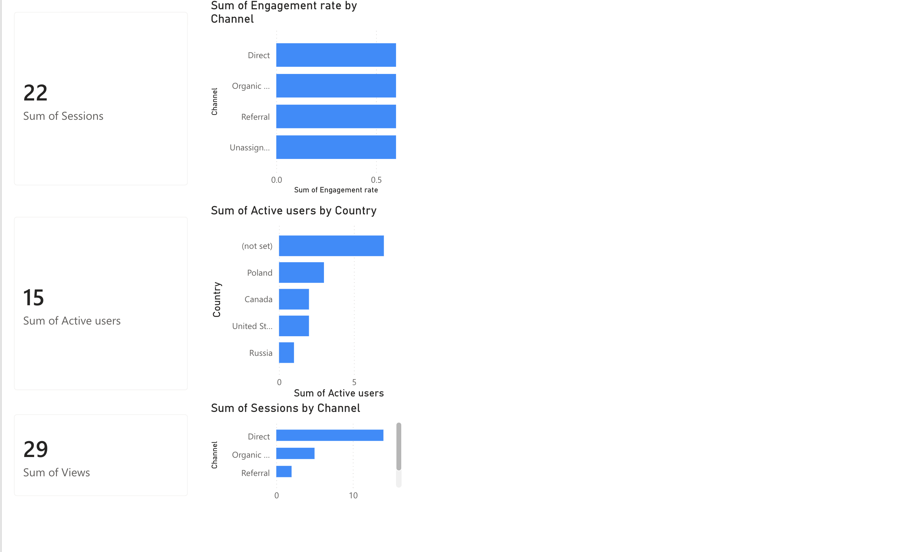

<div align="center">

# 📊 Portfolio Website Analytics — Power BI

**Interactive Power BI report analyzing real Google Analytics 4 traffic data from my portfolio website [janeckimateusz.com](https://janeckimateusz.com)**

[](https://powerbi.microsoft.com/)
[](https://analytics.google.com/)
[](https://janeckimateusz.com)



</div>

---

## 🎯 About the project

My portfolio website ([janeckimateusz.com](https://janeckimateusz.com)) runs Google Analytics 4
(via Google Tag Manager, with Consent Mode v2). This project takes the collected traffic data
and turns it into an interactive Power BI report — a small, end-to-end BI workflow:

**GA4 → CSV export → data cleaning → Excel data model → Power BI report**

## 📈 What the report shows

| Visual | Question it answers |
|---|---|
| KPI cards (Sessions, Active users, Views) | How much traffic does the site get? |
| Sessions by channel | Where do visitors come from? (Direct, Organic Search, Referral) |
| Engagement rate by channel | Which traffic source brings the most engaged visitors? |
| Active users by country | Where in the world are the visitors located? |

## 🔍 Key insights (Jun 21 – Jul 18, 2026)

- **Direct traffic dominates volume** (14 of 22 sessions) — mostly people typing the URL from my CV and LinkedIn profile.
- **Organic Search brings the highest quality traffic** — an **80% engagement rate** vs. only 14% for Direct, showing that visitors who find the site via Google actually explore it.
- **International reach**: visitors from Poland, Canada and the United States, with Polish users spending by far the most time on the site (~63 s average engagement).

## 📂 Repository structure

```
.
├── README.md
├── screenshots/
│   └── dashboard.png            # Report overview
├── report/
│   └── report.pdf               # Full report exported from Power BI
└── data/
    └── portfolio-analytics.xlsx # Cleaned GA4 data (Traffic, Pages, Countries)
```

## 🛠️ How it was built

1. **Data collection** — GA4 property on janeckimateusz.com (gtag.js + Google Tag Manager, Consent Mode v2 with Cookiebot).
2. **Export** — Traffic acquisition, Pages & screens and Demographic details reports exported to CSV from the GA4 UI.
3. **Cleaning** — removed export metadata, dropped empty columns, normalized headers and percentage formats; combined into a single Excel workbook with one sheet per table.
4. **Modeling & visualization** — workbook loaded into Power BI (Power Query), report built in Power BI Service.

## 🔄 Next steps

- Add a date-level table for a traffic-over-time trend line
- Automate the data refresh with the GA4 Data API instead of manual CSV exports
- Track key events (CV downloads, contact form submissions) as conversion metrics

---

<div align="center">

Part of my portfolio — see also [janeckimateusz.com](https://janeckimateusz.com) · [@JaneckiGit](https://github.com/JaneckiGit)

</div>
